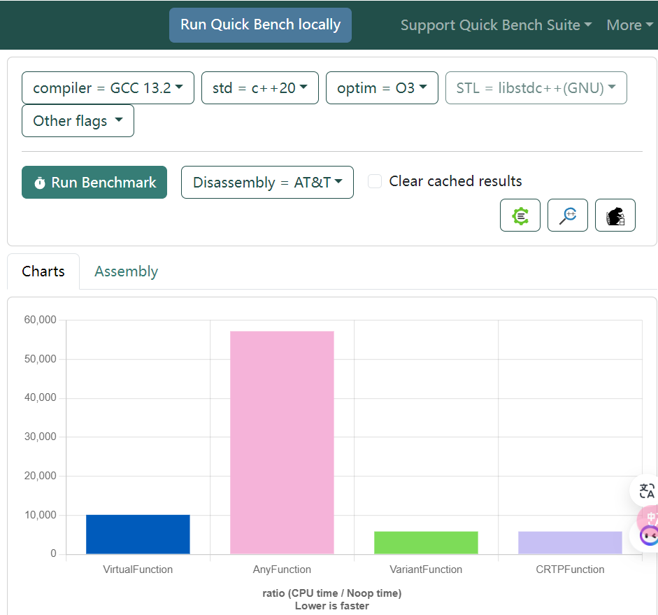
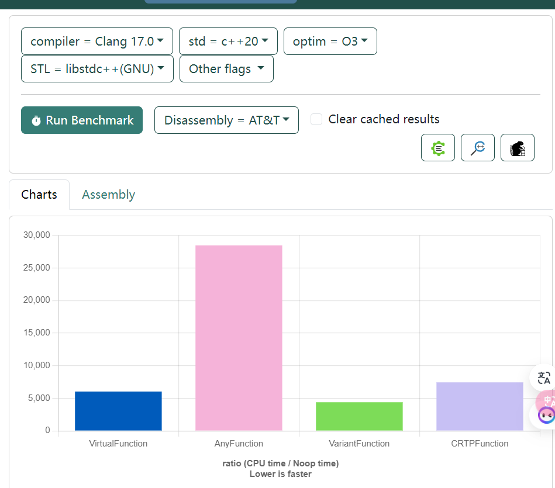

#! https://zhuanlan.zhihu.com/p/685712713
# 各种多态技术的性能测试

# 1. 说明

## 1.1. [各种多态技术介绍见: 这里](https://zhuanlan.zhihu.com/p/685359271)

## 1.2. 测试情况

+ 为了让代码不至于被优化掉，这里 的 move 统统返回了一个数字；
+ 都是 999个Animal 装到一个 vector，然后集中测试 从 vector 遍历调用move函数的性能

|下图 横坐标 名字|测试技术|
|--|--|
|VirtualFunction|虚函数|
|AnyFunction|std::any & 类型转换|
|VariantFunction|std::variant & std::visit|
|CRTPFunction|CRTP & std::variant & std::visit|

## 1.3. GCC 13.2，详情和代码见：[Quick Bench](https://quick-bench.com/q/tkAVYiiqH0LjclMeABsCiDKdp50)



## 1.4. Clang 17.0，详情和代码见：[Quick Bench](https://quick-bench.com/q/-FVeFVPn85eummqImksjytGD7w8)



# 2. 代码

## 2.1. 头文件

``` cpp​
#include <any>
#include <vector>
#include <variant>
#include <typeindex>
```

## 2.2. 虚函数 性能

``` cpp​
// ==================== 1. 虚函数性能测试

class AnimalVirtual {
public:
    // 返回 移动的距离，否则没有操作，就会被优化掉
    virtual int move()=0;

    virtual ~AnimalVirtual() = default;
};

class DogVirtual: public AnimalVirtual {
public:
    DogVirtual(int speed): m_speed(speed) {}

    int move() override {
        return m_speed * 7;
    }
private:
    int m_speed;
};

class BirdVirtual: public AnimalVirtual {
public:
    BirdVirtual(int speed): m_speed(speed) {}

    int move() override {
        return m_speed * 8;
    }
private:
    int m_speed;
};

class FishVirtual: public AnimalVirtual {
public:
    FishVirtual(int speed): m_speed(speed) {}

    int move() override {
        return m_speed * 9;
    }
private:
    int m_speed;
};

static void VirtualFunction(benchmark::State& state) {
    std::vector<AnimalVirtual*> animals;
    animals.reserve(999);
    
    for (int i = 0; i < 999; ++i) {
        if (i % 3 == 0) {
            animals.emplace_back(new DogVirtual(i));
        } else if (i % 3 == 1) {
            animals.emplace_back(new BirdVirtual(i));
        } else {
            animals.emplace_back(new FishVirtual(i));
        }
    }

    // 上面都是准备数据的过程，不在性能测试里面
    // 从这里开始才进入性能监控范围
    for (auto _ : state) {
        int totalMove = 0;
        for (const auto& a : animals) {
            totalMove += a->move();
        }

        // 标注不要优化这个变量，否则就整段代码优化没了。
        benchmark::DoNotOptimize(totalMove);
    }

    for (int i = 0; i < 999; ++i) {
        delete animals[i];
    }
}

// 开始运行性能测试
BENCHMARK(VirtualFunction);
```

## 2.3. `std::any` 性能

``` cpp
// ==================== 2. std::any 性能测试

class DogAny {
public:
    DogAny(int speed): m_speed(speed) {}

    int move() {
        return m_speed * 7;
    }
private:
    int m_speed;
};

class BirdAny {
public:
    BirdAny(int speed): m_speed(speed) {}

    int move() {
        return m_speed * 8;
    }
private:
    int m_speed;
};

class FishAny {
public:
    FishAny(int speed): m_speed(speed) {}
    
    int move() {
        return m_speed * 9;
    }
private:
    int m_speed;
};

int out_any(std::any const& val) {
    static auto dog_type { std::type_index(typeid(DogAny*)) };
    static auto fish_type { std::type_index(typeid(FishAny*)) };
    static auto bird_type { std::type_index(typeid(BirdAny*)) };

    const auto val_type { std::type_index(val.type()) };
    
    int r = 0;
    if (val_type == dog_type) {
        auto ptr = std::any_cast<DogAny*>(val);
        r = ptr->move();
    } else if (val_type == fish_type) {
        auto ptr = std::any_cast<FishAny*>(val);
        r = ptr->move();
    } else if (val_type == bird_type) {
        auto ptr = std::any_cast<BirdAny*>(val);
        r = ptr->move();
    }

    return r;
}

static void AnyFunction(benchmark::State& state) {
    std::vector<std::any> animals;
    animals.reserve(999);
    
    for (int i = 0; i < 999; ++i) {
        if (i % 3 == 0) {
            animals.emplace_back(new DogAny(i));
        } else if (i % 3 == 1) {
            animals.emplace_back(new BirdAny(i));
        } else {
            animals.emplace_back(new FishAny(i));
        }
    }

    // 上面都是准备数据的过程，不在性能测试里面
    // 从这里开始才进入性能监控范围
    for (auto _ : state) {
        int totalMove = 0;
        for (const auto& a : animals) {
            totalMove += out_any(a);
        }

        // 标注不要优化这个变量，否则就整段代码优化没了。
        benchmark::DoNotOptimize(totalMove);
    }

    for (int i = 0; i < 999; ++i) {
        if (i % 3 == 0) {
            auto p = std::any_cast<DogAny *>(animals[i]);
            delete p;
        } else if (i % 3 == 1) {
            auto p = std::any_cast<BirdAny *>(animals[i]);
            delete p;
        } else {
            auto p = std::any_cast<FishAny *>(animals[i]);
            delete p;
        }
    }
}

// 开始运行性能测试
BENCHMARK(AnyFunction);
```

## 2.4. `std::variant` & `std::visit` 性能

``` cpp
// ==================== 3. std::variant 性能测试

class DogVariant {
public:
    DogVariant(int speed): m_speed(speed) {}

    int move() {
        return m_speed * 7;
    }
private:
    int m_speed;
};

class BirdVariant {
public:
    BirdVariant(int speed): m_speed(speed) {}

    int move() {
        return m_speed * 8;
    }
private:
    int m_speed;
};

class FishVariant {
public:
    FishVariant(int speed): m_speed(speed) {}
    
    int move() {
        return m_speed * 9;
    }
private:
    int m_speed;
};

inline int animal_func(DogVariant *dog) {
    return dog->move();
}

inline int animal_func(FishVariant *fish) {
    return fish->move();
}

inline int animal_func(BirdVariant *bird) {
    return bird->move();
}

inline void animal_delete(DogVariant *dog) {
    delete dog;
}

inline void animal_delete(FishVariant *fish) {
    delete fish;
}

inline void animal_delete(BirdVariant *bird) {
    delete bird;
}

static void VariantFunction(benchmark::State& state) {
    using Animal = std::variant<DogVariant*, FishVariant*, BirdVariant*>;

    std::vector<Animal> animals;
    animals.reserve(999);
    
    for (int i = 0; i < 999; ++i) {
        if (i % 3 == 0) {
            animals.emplace_back(new DogVariant(i));
        } else if (i % 3 == 1) {
            animals.emplace_back(new FishVariant(i));
        } else {
            animals.emplace_back(new BirdVariant(i));
        }
    }

    // 上面都是准备数据的过程，不在性能测试里面
    // 从这里开始才进入性能监控范围
    for (auto _ : state) {
        int totalMove = 0;
        
        for (auto& animal : animals) {
            std::visit([&totalMove](auto&& arg) {
                totalMove += animal_func(arg);
            }, animal);
        }

        // 标注不要优化这个变量，否则就整段代码优化没了。
        benchmark::DoNotOptimize(totalMove);
    }

    for (auto& animal : animals) {
        std::visit([](auto&& arg) {
            animal_delete(arg);
        }, animal);
    }
}

// 开始运行性能测试
BENCHMARK(VariantFunction);
```

## 2.5. `CRTP` 性能

``` cpp
// ==================== 4. CRTP 性能测试

// Animal 是基类，D是模板化的子类
template<typename D>
class AnimalCRTP {
public:
    int move() {
        return derived().move_impl();
    }
private:
    D const& derived() const {
        // 注意：静态转换为具体类型，才能调用成员函数
        return static_cast<D const&>(*this); 
    };
};

class DogCRTP: public AnimalCRTP<DogCRTP> {
public:
    DogCRTP(int speed): m_speed(speed) {} 
private:
    friend AnimalCRTP;
    
    int move_impl() const {
        return m_speed * 7;
    }
private:
    int m_speed;
};

class BirdCRTP: public AnimalCRTP<BirdCRTP> {
public:
    BirdCRTP(int speed): m_speed(speed) {} 
private:
    friend AnimalCRTP;
    
    int move_impl() const {
        return m_speed * 8;
    }
private:
    int m_speed;
};

class FishCRTP: public AnimalCRTP<FishCRTP> {
public:
    FishCRTP(int speed): m_speed(speed) {} 
private:
    friend AnimalCRTP;

    int move_impl() const {
        return m_speed * 9;
    }
private:
    int m_speed;
};

inline void animal_crtp_delete(DogCRTP *dog) {
    delete dog;
}

inline void animal_crtp_delete(FishCRTP *fish) {
    delete fish;
}

inline void animal_crtp_delete(BirdCRTP *bird) {
    delete bird;
}

static void CRTPFunction(benchmark::State& state) {
    using Animal = std::variant<DogCRTP*, FishCRTP*, BirdCRTP*>;

    std::vector<Animal> animals;
    animals.reserve(999);
    
    for (int i = 0; i < 999; ++i) {
        if (i % 3 == 0) {
            animals.emplace_back(new DogCRTP(i));
        } else if (i % 3 == 1) {
            animals.emplace_back(new FishCRTP(i));
        } else {
            animals.emplace_back(new BirdCRTP(i));
        }
    }

    // 上面都是准备数据的过程，不在性能测试里面
    // 从这里开始才进入性能监控范围
    for (auto _ : state) {
        int totalMove = 0;
        
        for (auto& animal : animals) {
            std::visit([&totalMove](auto&& arg) {
                totalMove += arg->move();
            }, animal);
        }

        // 标注不要优化这个变量，否则就整段代码优化没了。
        benchmark::DoNotOptimize(totalMove);
    }

    for (auto& animal : animals) {
        std::visit([](auto&& arg) {
            animal_crtp_delete(arg);
        }, animal);
    }
}

// 开始运行性能测试
BENCHMARK(CRTPFunction);
```

