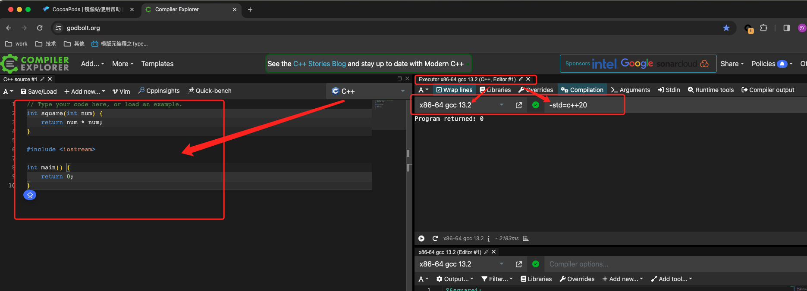

#! https://zhuanlan.zhihu.com/p/684051862
#  笔记  CppCon2020: C++20 之 Type Traits 

从 C++ 20 的 type_traits 的 某些类型的实现 讲述 模板元编程

注：下面的代码片段 可以 修改后 拷贝到 [Compiler Explorer](https://godbolt.org)运行



## 01. 来源

+ [Github CppCon2020的课件](https://github.com/CppCon/CppCon2020/blob/main/Presentations/template_metaprogramming_type_traits/template_metaprogramming_type_traits__jody_hagins__cppcon_2020.pdf)
+ [B站：模版元编程之Type Traits: 第一部分，下面的 02-12节](https://www.bilibili.com/video/BV1Yh411f7Yk)
+ [B站：模版元编程之Type Traits: 第二部分，下面的 13-28节](https://www.bilibili.com/video/BV1LK411g7ta)

# 02. MetaFunction 元函数

+ 元函数 是 泛型 类 / 结构体，不是一个函数
+ 元函数 是 模板 的 应用，不是语言的一部分

值元函数，输入 类型 / 值，输出 值 value

``` cpp
// 拷贝到这里运行：https://godbolt.org/

#include <iostream>

template <typename T>
struct ValueTemplate {
    static constexpr int value = 42;
};

int main() {
    static_assert(42 == ValueTemplate<int>::value);
    return 0;
}
```

类型元函数：输入 类型 / 值，输出 类型 type

``` cpp
// 拷贝到这里运行：https://godbolt.org/

#include <type_traits>

template <typename T>
struct TypeTemplate {
    using type = T;
};

int main() {
    static_assert(std::is_same_v<int, TypeTemplate<int>::type>);
    return 0;
}
```

# 03. 恒等函数

## 03.1. 最简单的例子：int型

常量 普通函数:

``` cpp
// 拷贝到这里运行：https://godbolt.org/

constexpr int int_identity(int x) {
    return x;
}

int main() {
    static_assert(int_identity(42) == 42);
    return 0;
}
```

元函数:

``` cpp
// 拷贝到这里运行：https://godbolt.org/

template <int X>
struct IntIdentity {
    static constexpr int value = X;
};

int main() {
    static_assert(IntIdentity<42>::value == 42);
    return 0;
}
```

## 03.2. 泛型

常量 泛型函数:

``` cpp
// 拷贝到这里运行：https://godbolt.org/

template <typename T>
constexpr T identity(T x) {
    return x;
}

int main() {
    static_assert(identity(42) == 42);
    return 0;
}
```

元函数:

``` cpp
// 拷贝到这里运行：https://godbolt.org/

template <typename T, T Value>
struct ValueIdentity {
    static constexpr T value = Value;
};

int main() {
    // 需要 指定类型，不方便
    static_assert(ValueIdentity<int, 42>::value == 42);

    return 0;
}
```

C++ 17 有了 auto 模板之后：

``` cpp
// 拷贝到这里运行：https://godbolt.org/

template <auto X>
struct Identity {
    static constexpr auto value = X;
};

int main() {
    static_assert(Identity<42>::value == 42);
    return 0;
}
```

惯例：引入 _v，方便调用，不需要 老写 ::value

``` cpp
// 拷贝到这里运行：https://godbolt.org/

template <auto X>
struct Identity {
    static constexpr auto value = X;
};

template <auto X>
inline constexpr auto Identity_v = Identity<X>::value;

int main() {
    static_assert(Identity_v<42> == 42);
    return 0;
}
```

# 04. 求和

普通函数，编译期 & 运行期

``` cpp
// 拷贝到这里运行：https://godbolt.org/

template<typename X, typename Y>
constexpr auto sum(X a, Y b) {
    return a + b;
}

int main() {
    static_assert(sum(1, 2) == 3);
    return 0;
}
```

元函数：

``` cpp
// 拷贝到这里运行：https://godbolt.org/

template<auto X, auto Y>
struct Sum {
    static constexpr auto value = X + Y;
};

int main() {
    static_assert(Sum<1, 2>::value == 3);
    return 0;
}
```

惯例：引入 _v，方便调用，不需要 老写 ::value

``` cpp
// 拷贝到这里运行：https://godbolt.org/

template<auto X, auto Y>
struct Sum {
    static constexpr auto value = X + Y;
};

template <auto X, auto Y>
inline constexpr auto Sum_v = Sum<X, Y>::value;

int main() {
    static_assert(Sum_v<1, 2> == 3);
    return 0;
}
```

# 05. 类型 元函数 示例

C++ 20，引入了 `std::type_identity`，实现 和 下面等同；

``` cpp
// 拷贝到这里运行：https://godbolt.org/

#include <iostream>

template <typename T>
struct TypeIdentity {
    using type = T;
};

template <typename T>
T default_value(T t) {
    // 使用时加`typename`（否则 编译器不能识别 泛型的 关联类型）
    typename TypeIdentity<T>::type a = T();

    return a;
}

int main() {
    auto v = default_value(112UL);
    std::cout << v << std::endl; // 0

    // 当T实例化为具体类型时，就不用加 `typename`
    TypeIdentity<int>::type a = 42;

    return 0;
}
```

惯例：引入 _t，方便调用，不需要 老写 ::type

``` cpp
// 拷贝到这里运行：https://godbolt.org/

#include <type_traits>

template <typename T>
struct TypeIdentity {
    using type = T;
};

template <typename T>
using TypeIdentity_t = typename TypeIdentity<T>::type;

int main() {
    static_assert(std::is_same_v<TypeIdentity_t<int>, int>);
    return 0;
}
```

# 06. `std::integral_constant`

``` cpp
// 拷贝到这里运行：https://godbolt.org/

#include <type_traits>

template <typename T, T v>
struct integral_constant {
    // 既是值元函数
    static constexpr T value = v;

    using value_type = T;
    
    // 又是类型元函数
    using type = integral_constant<T, v>;
    
    // T() 的 隐式转换
    constexpr operator value_type() const noexcept { 
        return value; 
    }
    
    // 可调用：函数对象
    constexpr value_type operator() () const noexcept { 
        return value; 
    }
};

int main() {
    static_assert(std::is_same_v<integral_constant<int, 50>, integral_constant<int, 50>::type>);

    static_assert(std::is_same_v<int, integral_constant<int, 50>::value_type>);

    integral_constant<int, 50> v;
    
    static_assert(v.value == 50);
    
    // operator ()
    static_assert(v() == 50);
    
    // operator T()
    static_assert(int(v) == 50);

    return 0;
}
```

定义 bool:

``` cpp
// 拷贝到这里运行：https://godbolt.org/

// integral_constant 定义如上
template <typename T, T v>
struct integral_constant {
    // 既是值元函数
    static constexpr T value = v;

    using value_type = T;
    
    // 又是类型元函数
    using type = integral_constant<T, v>;
    
    // T() 的 隐式转换
    constexpr operator value_type() const noexcept { 
        return value; 
    }
    
    // 可调用：函数对象
    constexpr value_type operator() () const noexcept { 
        return value; 
    }
};

template <bool B>
using bool_constant = integral_constant<bool, B>;

// 0 元函数，没有参数
using true_type = bool_constant<true>;

using false_type = bool_constant<false>;

int main() {
    static_assert(true_type::value == true);

    auto r = true_type {};

    static_assert(bool(r) == true); // operator  value_type()

    static_assert(r() == true);     // operator ()

    return 0;
}
```

# 07. `Cpp17UnaryTypeTrait`

+ 类模板
+ 只有1个模板参数
+ Cpp17DefaultConstructible
+ Cpp17CopyConstructible
+ 从 std::integral_constant 继承
+ 基类成员不能隐藏，而且必须 public

# 08. `Cpp17BinaryTypeTrait`

+ 类模板
+ 只有2个模板参数
+ Cpp17DefaultConstructible
+ Cpp17CopyConstructible
+ 从 std::integral_constant 继承
+ 基类成员不能隐藏，而且必须 public

# 09. `Cpp17TransformationTrait`

+ 类模板
+ 1个模板参数
+ public 嵌套 type 类型
+ 没有 默认 / 拷贝 构造
+ 没有 继承

# 10. `std::is_void`: Unary Type Trait

``` cpp
// 拷贝到这里运行：https://godbolt.org/

#include <type_traits>

// 一般 情况，是 false
template <typename T>
struct is_void: std::false_type {};

// 为 void 特化
template <> // 完全特化
struct is_void<void>: std::true_type {};

int main() {
    // is_void<void> {} 是 一个 对象，该对象有 operator bool() 隐式转换成 bool
    static_assert(is_void<void> {}); 
    
    static_assert(!is_void<bool> {});
}
```

## 10.1. cv-qualified 修饰: `consnt / volatile`

标准规定：T 和 const T 以及 volatile T 都能得到 相同的结果

``` cpp
// 拷贝到这里运行：https://godbolt.org/

#include <type_traits>

int main() {
    static_assert(std::is_void<void const> {} && std::is_void<void> {});

    static_assert(std::is_void<void volatile> {} && std::is_void<void> {});

    return 0;
}
```

为了达到这一点，这个 is_void 要重新实现如下：

``` cpp
// 拷贝到这里运行：https://godbolt.org/

#include <type_traits>

// 一般 情况，是 false
template <typename T>
struct is_void: std::false_type {};

// 为 void 特化
template <> // 完全特化
struct is_void<void>: std::true_type {};

template <> // 完全特化
struct is_void<void const>: std::true_type {};

template <> // 完全特化
struct is_void<void volatile>: std::true_type {};

template <> // 完全特化
struct is_void<void const volatile>: std::true_type {};

template <typename T>
inline constexpr bool is_void_v = is_void<T>::value;

int main() {
    static_assert(is_void_v<void const> && is_void_v<void>);
    static_assert(is_void_v<void volatile> && is_void_v<void>);
    return 0;
}
```

# 11. `std::remove_coost`: Transformation Trait  

输入输出：

+ remove_const<int> --> int
+ remove_const<const int> --> int
+ remove_const<const volatile int> -> volatile int
+ remove_const<int*> -> int*
+ remove_const<int * const> -> int*         // 注意 const 修饰的是指针，意思是 指针 不能 指向别的 int
+ remove_const<int const *> -> int const *  // 注意：指针 指向 int const，该值不能修改
+ remove_const<int const * const> -> int const *

``` cpp
// 拷贝到这里运行：https://godbolt.org/

#include <type_traits>

// 主模板声明
template <typename T>
struct remove_const: std::type_identity<T> {};

// 模板偏特化
template <typename T>
struct remove_const<T const>: std::type_identity<T> {};

template <typename T>
using remove_const_t = typename remove_const<T>::type;

int main() {
    static_assert(std::is_same_v<remove_const_t<int>, int>, "int is the same");
    static_assert(std::is_same_v<remove_const_t<const int>, int>, "const int is the same as int");
 
    return 0;
}
```

# 12. `std::conditional_t`: Transformation Trait

std::conditional_t<bool, T, F> 当 bool 成立 类型就是 T，否则就是 F

``` cpp
// 拷贝到这里运行：https://godbolt.org/

#include <type_traits>

template <bool Condition, typename T, typename F>
struct struct_conditional: std::type_identity<T> {};

// 偏特化
template <typename T, typename F>
struct struct_conditional<false, T, F>: std::type_identity<F> {};

template <bool Condition, typename T, typename F>
using conditional_t = typename struct_conditional<Condition, T, F>::type;

int main() {
    static_assert(std::is_same_v<int, conditional_t<std::is_void_v<void>, int, long>>);
    
    static_assert(std::is_same_v<long, conditional_t<std::is_void_v<char>, int, long>>);
    
    return 0;
}
```

# 13. 14种 Primary type categories

+ std::is_void: 4次特化，void, void const, void volatile, void const volatile
+ std::is_null_pointer `C++ 14`, 4次特化
+ std::is_integral: 16 * 4 次 特化；
    - bool
    - signed char, short, int, long, long long
    - unsigned char, unsigned short, unsigned int, unsigned long, unsigned long long
    - char, wchat_t, char8_t, char16_t, char32_t
+ std::is_floating_point: 3 * 4 次 特化
    - float, double, long double
+ std::is_array
+ std::is_enum
+ std::is_union
+ std::is_class
+ std::is_function
+ std::is_pointer
+ std::is_lvalue_reference
+ std::is_rvalue_reference
+ std::is_member_object_pointer
+ std::is_member_function_pointer

# 14. 元函数 抽象

生成模板的模板：因为 std::is_integral 有 16*4 次 特化，所以需要尝试抽象元函数；

只要能实现 如下几个 Transformer Trait 就可以 大大减少 写代码的 特化数量：

+ remove_const 见 第11节
+ remove_volatile
+ remove_cv
+ remove_signed

# 15. `std::remove_volatile`

``` cpp
// 拷贝到这里运行：https://godbolt.org/

#include <type_traits>

template <typename T>
struct remove_volatile: std::type_identity<T> {};

// 模板偏特化
template <typename T>
struct remove_volatile<T volatile>: std::type_identity<T> {};

template <typename T>
using remove_volatile_t = typename remove_volatile<T>::type;

int main() {
    static_assert(std::is_same_v<remove_volatile_t<int volatile>, int>);
    return 0;
}
```

# 16. `std::remove_cv`

``` cpp
// 拷贝到这里运行：https://godbolt.org/

#include <type_traits>

// 实现 remove_cv
template <typename T>
using remove_cv = std::remove_const<std::remove_volatile_t<T>>;

template <typename T>
using remove_cv_t = typename remove_cv<T>::type;

int main () {
    static_assert(std::is_same_v<remove_cv_t<int const volatile>, int>);
    return 0;
}

```

# 17. `std::is_same` 比较类型

``` cpp
// 拷贝到这里运行：https://godbolt.org/

#include <type_traits>

template <typename T1, typename T2>
struct is_same: std::false_type {};

template <typename T>
struct is_same<T, T>: std::true_type {};

template <typename T1, typename T2>
inline constexpr bool is_same_v = is_same<T1, T2>::value;

int main() {
    static_assert(is_same_v<int, int>);
    static_assert(!is_same_v<int, double>);
    
    return 0;
}
```

# 18. 方便 比较 函数 is_sam_raw

``` cpp
// 拷贝到这里运行：https://godbolt.org/

#include <type_traits>

template <typename T1, typename T2>
using is_same_raw = std::is_same<remove_cv_t<T1>, remove_cv_t<T2>>;

template <typename T1, typename T2>
inline constexpr bool is_same_raw_v = is_same_raw<T1, T2>::value;

```

# 19. `std::is_floating_point`

``` cpp
// 拷贝到这里运行：https://godbolt.org/

#include <type_traits>

// is_same_raw 抄上面
template <typename T1, typename T2>
using is_same_raw = std::is_same<std::remove_cv_t<T1>, std::remove_cv_t<T2>>;

template <typename T1, typename T2>
inline constexpr bool is_same_raw_v = is_same_raw<T1, T2>::value;

template <typename T>
using is_floating_point = std::bool_constant<
    is_same_raw_v<T, float>
    || is_same_raw_v<T, double>
    || is_same_raw_v<T, long double>
>;

template <typename T>
inline constexpr bool is_floating_point_v = is_floating_point<T>::value;

int main() {
    static_assert(is_floating_point_v<float>);
    return 0;
}
```

# 20. `std::is_integral`

``` cpp
// 拷贝到这里运行：https://godbolt.org/

#include <type_traits>

// is_same_raw 抄上面
template <typename T1, typename T2>
using is_same_raw = std::is_same<std::remove_cv_t<T1>, std::remove_cv_t<T2>>;

template <typename T1, typename T2>
inline constexpr bool is_same_raw_v = is_same_raw<T1, T2>::value;

template <typename T>
using is_integral = std::bool_constant<
    is_same_raw_v<T, signed char>
    || is_same_raw_v<T, short>
    || is_same_raw_v<T, int>
    || is_same_raw_v<T, long>
    || is_same_raw_v<T, long long>
    || is_same_raw_v<T, unsigned char>
    || is_same_raw_v<T, unsigned short>
    || is_same_raw_v<T, unsigned int>
    || is_same_raw_v<T, unsigned long>
    || is_same_raw_v<T, unsigned long long>
    || is_same_raw_v<T, char>
    || is_same_raw_v<T, char8_t>
    || is_same_raw_v<T, char16_t>
    || is_same_raw_v<T, char32_t>
    || is_same_raw_v<T, wchar_t>
    || is_same_raw_v<T, bool>
>;

template <typename T>
inline constexpr bool is_integral_v = is_integral<T>::value;

int main() {
    static_assert(is_integral_v<int>);
    return 0;
}
```

# 21. `is_type_in_pack` 概述

``` cpp

template <typename TargetT, typename ... Ts>
using is_type_in_pack = ...

template <typename T>
using is_integral = is_type_in_pack<remove_cv_t<T>,
    bool,
    char, wchar_t, char8_t, char16_t, char32_t,
    singned char, short, int, long, long long,
    unsigned char, unsigned short, unsigned int, unsigned long, unsigned long long
>;
```

# 22. `std::is_array`

``` cpp
// 拷贝到这里运行：https://godbolt.org/

#include <type_traits>

template <typename T>
struct is_array : std::false_type {};

template <typename T, std::size_t N>
struct is_array<T[N]> : std::true_type {};

// 无界数组
template <typename T>
struct is_array<T[]> : std::true_type {};

template <typename T>
inline constexpr bool is_array_v = is_array<T>::value;

int main() {
    static_assert(!is_array_v<int>);

    // 匹配 T = int, N = 5
    static_assert(is_array_v<int[3]>);

    // 匹配 T = int
    static_assert(is_array_v<int[]>);

    return 0;
}

```

# 23. `std::is_pointer`

``` cpp
// 拷贝到这里运行：https://godbolt.org/

#include <type_traits>

namespace details {
    template <typename T>
    struct is_pointer_impl: std::false_type {};

    template <typename T>
    struct is_pointer_impl<T *>: std::true_type {};
}

template <typename T>
using is_pointer = details::is_pointer_impl<std::remove_cv_t<T>>;

template <typename T>
inline constexpr bool is_pointer_v = is_pointer<T>::value;

int main() {
    static_assert(is_pointer_v<int*>);

    return 0;
}
```

# 24. 编译器内置实现

大部分 type-trait 都是编译器内置实现的；

+ `std::is_union`
+ `std::is_class`

# 25. 简化实现：is_union_or_class

如果 已经知道 T 是 第13节定义的14种类型之一，如何初步区分 union 或 class

+ 有 成员
+ 指向成员的指针是否有效（注：即使 类 没有成员，依然可以有 指向成员的指针）

逐渐说明：

+ `int*` 是 合法的指针，可以指向 int
+ `int Foo*` 是 Foo的成员指针

``` cpp
// 拷贝到这里运行：https://godbolt.org/

struct Foo {};

// 可以看到 即使 Foo 没有成员，这里 也是合法的
using FooInObjectMemPtr = int Foo::*;

// 这个会语法报错
// using LongInObejctMemPtr = int long::*;

int main() {
    return 0;
}
```

# 26. 标签分发：函数重载解析 （Function Overload Resolution）

``` cpp
// 拷贝到这里运行：https://godbolt.org/

#include <type_traits>

namespace detail {
    // 注意：这里没有具体实现
    std::true_type is_nullptr(std::nullptr_t);

    std::false_type is_nullptr(...);
}

template <typename T>
using is_null_pointer = decltype(detail::is_nullptr(std::declval<T>()));

int main() {
    static_assert(not is_null_pointer<int>::value);

    static_assert(is_null_pointer<std::nullptr_t>::value);
    
    return 0;
}
```

再来一个 is_const

``` cpp
// 拷贝到这里运行：https://godbolt.org/

#include <type_traits>

namespace detail {
    // 注意：这里没有具体实现
    template<typename T>
    std::true_type is_const(std::type_identity<T const>);

    template<typename T>
    std::false_type is_const(std::type_identity<T>);
}

template <typename T>
using is_const = decltype(detail::is_const(std::declval<std::type_identity<T>>()));

int main() {
    static_assert(not is_const<int>::value);

    static_assert(is_const<const int>::value);
    
    return 0;
}
```

# 27. `SFINAT`: 替换失败非错误

实现 can_have_pointer_to_member

``` cpp
// 拷贝到这里运行：https://godbolt.org/

#include <type_traits>

template<typename T>
std::true_type can_have_pointer_to_member(int T::*);

template<typename T>
std::false_type can_have_pointer_to_member(...);

int main() {
    struct Foo {};
    static_assert( decltype(can_have_pointer_to_member<Foo>(nullptr))::value );

    return 0;
}
```

# 28. `is_class` 简化版本

``` cpp
// 拷贝到这里运行：https://godbolt.org/

#include <type_traits>

namespace detail {
    template<typename T>
    constexpr bool is_class_or_union(int T::*) {
        return not std::is_union<T>::value;
    }

    template<typename T>
    constexpr bool is_class_or_union(...) {
        return false;
    }
}

template <typename T>
using is_class = std::bool_constant<detail::is_class_or_union<T>(nullptr)>;

int main() {
    struct Foo {};
    static_assert(is_class<Foo>::value);
    return 0;
}
```
